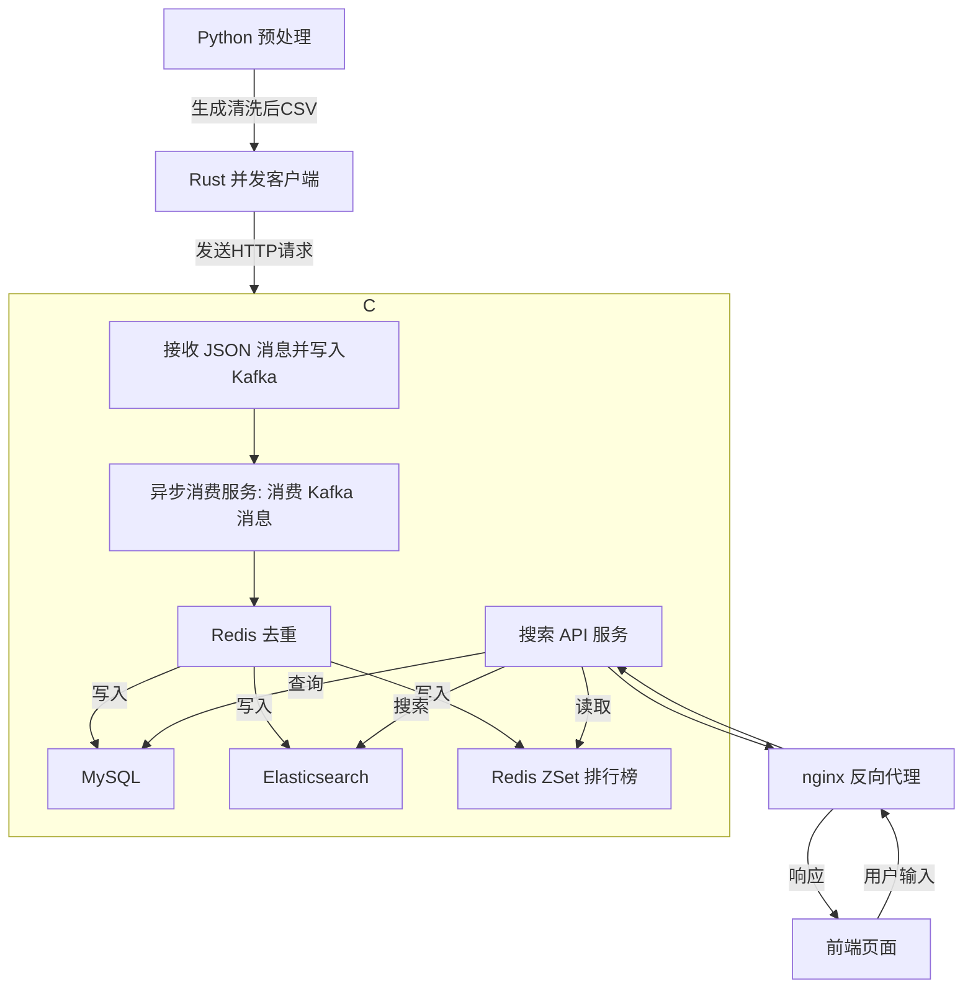

# 基于 eBay 产品数据集实现数据存储和搜索服务示例项目

数据集来自互联网公开，如有需要可联系。

## 1. 项目流程图



## 2. 项目模块划分

1. Python 预处理模块，目录：data-cleaning-processing
2. Rust 并发客户端模块，目录：product-message-sending
3. Spring Boot 服务模块，目录：ebay-product-search
4. 前端页面和 Web 服务器，目录：nginx-1.27.5

## 3. 项目涉及到的组件

1. Python 3.10+
2. Rust 1.82.0
3. Spring Boot 3.4.4
4. JDK 17
5. Maven 3.9.5
6. ZooKeeper 3.5.10
7. Kafka 2.5.1
8. MariaDB 10.11.3
9. Elasticsearch 8.15.2
10. Kibana 8.15.2
11. Redis 6.2.10
12. nginx 1.27.5
13. Docker 26.1.4
14. Docker Compose 2.27.1

## 4. 项目环境构建

### 4.1. Python 依赖

```bash
pip install numpy pandas
```

### 4.2. Rust 项目编译

```bash
cd product-message-sending
# 可执行文件位置在 target/release 目录下
cargo build --release
```

### 4.3. Spring Boot 项目编译

```bash
cd ebay-product-search
# jar 包位置在 target 目录下
mvn clean package -DskipTests
```

## 5. 项目运行

### 5.1. 基础环境运行

1. 启动 ZooKeeper
2. 启动 Kafka
3. 启动 MariaDB
4. 启动 Elasticsearch
5. 启动 Redis

需要保证上述软件正常运行。

### 5.2. 创建 MySQL 数据库表

```sql
CREATE DATABASE IF NOT EXISTS ebay CHARACTER SET utf8mb4 COLLATE utf8mb4_general_ci;
USE ebay;
CREATE TABLE product (
    uniq_id CHAR(32) PRIMARY KEY NOT NULL, -- 主键（非自增）
    crawl_timestamp DATETIME NOT NULL,        -- 爬取时间
    page_url VARCHAR(255) NOT NULL,           -- 产品页面URL
    title VARCHAR(255) NOT NULL,              -- 产品标题
    model_num VARCHAR(100),                   -- 产品型号
    manufacturer VARCHAR(255),                -- 厂商名称
    model_name VARCHAR(1000),                 -- 型号名称
    price DECIMAL(10, 2),                     -- 价格
    stock TINYINT(1),                         -- 是否有库存（0/1）
    carrier VARCHAR(255),                     -- 运营商
    color_category VARCHAR(50),               -- 颜色分类
    internal_memory VARCHAR(20),              -- 内存配置
    screen_size VARCHAR(32),                  -- 屏幕尺寸
    discontinued TINYINT(1) DEFAULT 0,        -- 是否停售（0/1）
    broken_link TINYINT(1) DEFAULT 0,         -- 链接是否失效（0/1）
    seller_rating DOUBLE,                     -- 卖家评分
    seller_num_of_reviews INT,                -- 卖家评价数量
    average_star DOUBLE,               -- 平均评分（保留1位小数）
    created_at TIMESTAMP DEFAULT CURRENT_TIMESTAMP -- 创建时间（可选）
) ENGINE=InnoDB DEFAULT CHARSET=utf8mb4 COLLATE=utf8mb4_unicode_ci;
```

为 manufacturer 字段添加索引：

```sql
CREATE INDEX idx_manufacturer ON product(manufacturer);
```

### 5.3. 创建 Elasticsearch 索引

```http
PUT /product_index
{
  "settings": {
    "number_of_shards": 1,
    "number_of_replicas": 0
  },
  "mappings": {
    "dynamic" : "strict",
    "properties": {
      "title": {
        "type": "text",
        "analyzer": "standard"
      },
      "model_name": {
        "type": "text",
        "analyzer": "standard"
      }
    }
  }
}
```

### 5.4. 创建 Kafka Topic
```bash
# 进入 Kafka 安装目录执行
bin/kafka-topics.sh --create --bootstrap-server localhost:9092 --replication-factor 1 --partitions 1 --topic ebayProductMessage
```

### 5.5. 运行数据预处理生成 CSV
```bash
cd data-cleaning-processing
python main.py
```

执行后会生成 `ebay-product.csv`

### 5.6. 运行 Spring Boot 服务

提前根据实际配置修改 `application.yml` 文件，确保配置正确，配置文件在 ebay-product-search/src/main/resources 目录下。

```shell
# 启动 Spring Boot 服务，JDK 可以自己指定安装的 17 版本
/opt/jdk-17.0.14+7/bin/java -jar ebay-product-search-1.0-SNAPSHOT.jar \
  --spring.config.location=application.yml
```

### 5.7. 运行 Rust 客户端生产数据
```bash
# 需要将生成的 CSV 文件放到和可执行文件同一目录下
./product-message-sending
```

### 5.9. 运行后确认写入成功

运行后查询确认 MySQL 总条数应为：29894

```sql
-- 查询总条数
select count(*) from product;
+----------+
| count(*) |
+----------+
|    29894 |
+----------+
-- 查询有效的条数， 这个条数应该和 Elasticsearch 中的一致
select count(*) from product where stock = 1 and discontinued = 0 and broken_link = 0;
+----------+
| count(*) |
+----------+
|    27929 |
+----------+
```

确认 Elasticsearch 总条数：
```http
GET /product_index/_count
```
```json
{
  "count": 27929,
  "_shards": {
    "total": 1,
    "successful": 1,
    "skipped": 0,
    "failed": 0
  }
}
```

### 5.10. 确认接口是否可用

具体可以参考 ebay-product-search/README.md 接口文档确认接口是否好用。

可以通过 curl 或者 Postman 等工具测试接口是否可用。

### 5.11. 运行 nginx 服务

nginx 采用 Docker 运行，首先进入到 nginx 目录下：
```shell
cd nginx-1.27.5
```

前端页面在 `html` 下，具体的配置文件在 `conf.d` 目录下，需要修改 `conf.d/defaults.conf` 指定正确的 Spring Boot 服务地址：
```nginx
server {
    # 其他配置
    # ...

    # 反向代理配置
    location /api/product {
        proxy_pass http://192.168.1.11:18081;  # 后端服务地址
        proxy_set_header Host $host;
        proxy_set_header X-Real-IP $remote_addr;
        proxy_set_header X-Forwarded-For $proxy_add_x_forwarded_for;
        proxy_set_header X-Forwarded-Proto $scheme;
    }
}
```

配置后拉取 nginx 镜像：

```shell
docker pull nginx:1.27.5
```

运行 nginx 服务：

```shell
docker compose up -d
# 查看日志 确认正常
docker compose logs -f
```

nginx 的日志映射到主机的 `/var/log/nginx` 目录下
    - 访问日志是 `access.log`
    - 错误日志是 `error.log`

### 5.12. 访问前端页面

通过浏览器访问服务器的 IP 打开页面，确认是否正常使用。

